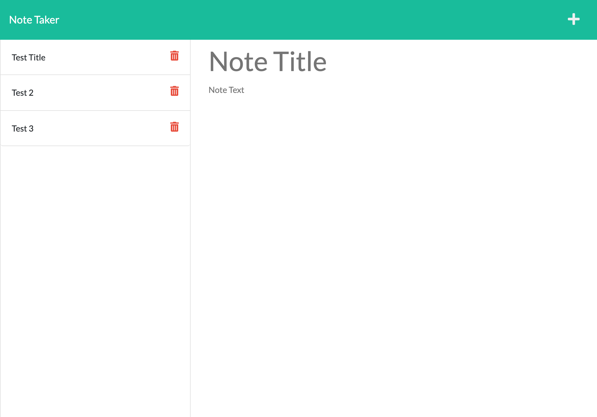

# note-taker

**Description:**

This note-taker app will help you get all your notes, thoughts, and to-do's organized in one place! Once the page is loaded, simply click "get started" and you will be redirected to the note taker page. Just write your note and title, and click the save button at the top of your screen. Your note will require both the title and the note content in order to save.

(Clicking previous notes and delete functionality will be updated soon)

**Screenshot of Application:**

**Link to Application:**

https://dashboard.heroku.com/apps/mk-note-taker